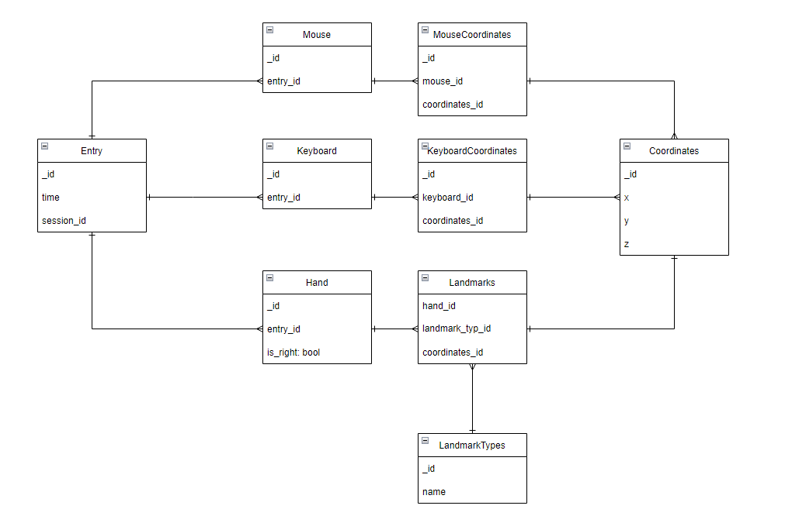

# README

This code contains a class `Database` that connects to a sqlite database and creates various tables to store data about mouse and keyboard movements, as well as hand landmarks.

## Class Definitions

### database.py

This file initializes a connection to the database and creates the necessary tables if they do not exist. It also stores counters for the IDs of various entries in the database to ensure that each entry has a unique ID.

## Function Definitions

### `__create_tables(self)`

This function creates the necessary tables in the database if they do not exist. The tables include `entry`, `mouse`, `keyboard`, `hand`, `coordinates`, `landmarks`, `mouseCoordinates`, and `keyboardCoordinates`.

### `database_entry(self, hand_landmarks, mouse_box, keyboard_box)`

This function is the main function for creating a new entry in the database. It calls several other functions to insert data into the different tables.

#### Parameters

- `hand_landmarks`: a list of hand landmarks in the format `[['Right', 3, (537, 239, -0.07019183784723282)], ... ]`
- `mouse_box`: a list of mouse coordinates in the format `[['mouse', '0.59', (20, 456, 760, 522)]]`
- `keyboard_box`: a list of keyboard entries in the format `[['keyboard', '0.29', (73, 245, 404, 144)]]`

### `__entry_entry(self)`

This function inserts a new entry into the `entry` table.

### `__landmarks_entry(self, hand_landmarks)`

This function inserts new hand landmarks into the `landmarks`, `landmarkTypes`, `coordinates`, and `hand` tables.

#### Parameters

- `hand_landmarks`: a list of hand landmarks in the format `[['Right', 3, (537, 239, -0.07019183784723282)], ... ]`

### `__mouse_coordinates_entry(self, mouse_box)`

This function inserts new mouse coordinates into the `mouseCoordinates` and `coordinates` tables.

#### Parameters

- `mouse_box`: a list of mouse coordinates in the format `[['mouse', '0.59', (20, 456, 760, 522)]]`

### `__landmarks_entry(self, hand_landmarks)`

This function inserts new hand landmarks into the `landmarks`, `landmarkTypes`, `coordinates`, and `hand` tables.

#### Parameters

- `hand_landmarks`: a list of hand landmarks in the format `[['Right', 3, (537, 239, -0.07019183784723282)], ... ]`

### `__mouse_coordinates_entry(self, mouse_box)`

This function inserts new mouse coordinates into the `mouseCoordinates` and `coordinates` tables.

#### Parameters

- `mouse_box`: a list of mouse coordinates in the format `[['mouse', '0.59', (20, 456, 760, 522)]]`
